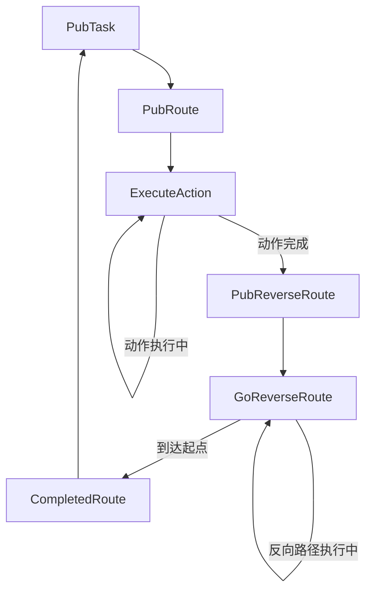

# AutoNavBehavior 状态机功能分析

## 概述

`AutoNavBehavior()` 是 DeviceManager 类中实现的一个核心状态机，用于控制机器人的自动导航行为。经过优化后，该状态机能够完整管理机器人执行复杂任务的整个生命周期，包括任务发布、路线规划、动作执行、反向路径返回等完整流程。

## 状态机架构

### 状态定义（TaskStatus 枚举）

```cpp
enum class TaskStatus : uint8_t {
    PubTask = 0,        // 发布任务状态
    PubRoute,           // 发布路线状态
    GoForwardRoute,     // 执行正向路线状态（新增）
    ExecuteAction,      // 执行动作状态
    PubReverseRoute,    // 发布反向路线状态
    GoReverseRoute,     // 执行反向路线状态
    CompletedRoute      // 任务完成状态
};
```

### 优化后的状态机实现

```cpp
void DeviceManager::AutoNavBehavior()
{
  /* task action client */
  switch (task_state_)
  {
  case TaskStatus::PubTask:
    PubTask();
    break;
  case TaskStatus::PubRoute:
    PubRoute();
    break;
  case TaskStatus::GoForwardRoute:    // 新增：正向导航状态
    ExecuteMoveBehavior();
    break;
  case TaskStatus::ExecuteAction:
    ExecuteActionBehavior();
    break;
  case TaskStatus::PubReverseRoute:
    PubReverseRoute();
    break;
  case TaskStatus::GoReverseRoute:
    ExecuteMoveBehavior();
    break;
  case TaskStatus::CompletedRoute:
    HandleRouteCompleted();
    break;
  default:
    ROS_ERROR("unkown task step:%d", static_cast<int>(task_state_));
    break;
  }
}
```

## 各状态详细功能

### 1. PubTask 状态

**功能**: 任务发布和初始化
- 从任务队列中取出当前可执行的任务
- 验证任务的有效性和可执行性
- 设置任务的初始状态和参数
- 转换到 `PubRoute` 状态

**关键代码**:
```cpp
bool DeviceManagerTask::PubTask()
{
  if (!ready_tasks_.empty())
  {
    dm->cur_task_ = PeekFrontReadyTasks();
    dm->task_state_ = TaskStatus::PubRoute;
    ROS_INFO("Start Task:%s", dm->cur_task_.id.c_str());
    return true;
  }
  return false;
}
```

### 2. PubRoute 状态

**功能**: 路线规划和发布
- 根据当前任务和区域信息生成导航路径
- 读取预定义的路径文件
- 启动正向路径执行
- 转换到 `ExecuteAction` 状态

**关键特性**:
- 支持多区域任务执行
- 动态切换下一个区域或动作
- 文件路径格式：`sim_{floor}F_{area}A`

### 3. ExecuteAction 状态

**功能**: 执行导航和任务动作
- **ExecuteActionBehavior()**: 根据任务类型执行相应的动作
- **ExecuteMoveBehavior()**: 执行实际的移动控制

#### 支持的动作类型：

##### 空气质量检测类任务
```cpp
- "IAQ_Inspection"   // 室内空气质量检测
- "Lux_Level"        // 光照度检测
- "Noise_Level"      // 噪音水平检测
- "Temperature"      // 温度检测
- "Humidity"         // 湿度检测
- "Air_Flow"         // 气流检测
```

**执行特点**:
- 动作启动后状态保持在 `ExecuteAction`
- 等待异步动作完成的回调

### 4. PubReverseRoute 状态

**功能**: 发布反向路线
- 创建当前路径的反向版本
- 启动反向路径执行
- 转换到 `GoReverseRoute` 状态

**关键实现**:
```cpp
bool DeviceManager::PubReverseRoute()
{
  if (motion_) {
    if (motion_->StartExecuteReverse()) {
      task_state_ = TaskStatus::GoReverseRoute;
      return true;
    }
  }
  return false;
}
```

### 5. GoReverseRoute 状态

**功能**: 执行反向路径导航
- 沿反向路径移动回到起点
- 监控移动状态和位置反馈
- 路径完成后由运动模块触发状态转换

### 6. CompletedRoute 状态

**功能**: 任务完成处理

**重要更新**: 正确处理任务完成，避免重复执行：

```cpp
void DeviceManager::HandleRouteCompleted()
{
  ROS_INFO("Current task completed, transitioning to next task");
  
  // 从任务队列中移除已完成的任务
  if (task_helper_) {
    task_helper_->PopFrontReadyTasks();
    ROS_INFO("Completed task removed from queue");
  }
  
  // 重置air_quality Goal发送标志位，为下个任务做准备
  air_quality_goal_sent_ = false;
  
  // 重置任务状态到发布任务，准备执行下一个任务
  task_state_ = TaskStatus::PubTask;
}
```

**关键修复**:
- 从任务队列中正确移除已完成的任务
- 重置Goal发送标志位，确保下个任务正常工作
- 避免了同一任务被重复执行的问题

## 核心回调函数

### AirQualityDone 回调

**更新**: 完成后自动转换到反向路径状态

```cpp
void DeviceManager::AirQualityDone(const actionlib::SimpleClientGoalState &state,
                                  const cruise_msgs::TaskExecuterResultConstPtr &result)
{
  ROS_INFO("AirQuality got state [%s]", state.toString().c_str());
  if (!result)
    return;
  ROS_INFO("AirQuality got result");
  
  // 重置air_quality Goal发送标志位
  air_quality_goal_sent_ = false;
  
  // 空气质量检测完成后，转换状态到发布反向路线
  ROS_INFO("Air quality detection completed, transitioning to publish reverse route");
  task_state_ = TaskStatus::PubReverseRoute;
}
```

**关键特性**:
- 重置Goal发送标志位，为任务完成做清理
- 自动转换到反向路径执行状态
- 确保整个任务流程的连贯性

## 运动控制模块集成

### DeviceManagerMotion 增强

**新增特性**:
- `is_reverse_execution_` 标记区分正向/反向执行
- `StartExecuteReverse()` 方法创建反向路径
- 智能状态转换逻辑

**反向路径生成**:
```cpp
bool DeviceManagerMotion::StartExecuteReverse()
{
  // 创建反向路径
  nav_msgs::Path reversed_route = cur_route_;
  std::reverse(reversed_route.poses.begin(), reversed_route.poses.end());
  
  // 设置反向执行标记
  is_reverse_execution_ = true;
  // 开始执行
  return true;
}
```

**智能状态转换**:
```cpp
if (exe_routes_.empty())
{
  if (is_reverse_execution_) {
    dm->task_state_ = TaskStatus::CompletedRoute;
    is_reverse_execution_ = false;
  } else {
    dm->task_state_ = TaskStatus::PubRoute;
  }
}
```

## 完整工作流程



### 详细流程说明

1. **任务初始化**: PubTask → PubRoute
2. **正向导航**: PubRoute → GoForwardRoute
3. **路径执行完成**: GoForwardRoute → ExecuteAction
4. **动作执行**: ExecuteAction (等待异步完成，使用标志位防止重复发送)
5. **反向规划**: ExecuteAction → PubReverseRoute
6. **反向执行**: PubReverseRoute → GoReverseRoute
7. **任务完成**: GoReverseRoute → CompletedRoute
8. **任务清理**: CompletedRoute (移除任务，重置标志位) → PubTask

## 关键优化点

### 1. 状态分离
- 将动作执行和路径规划分离
- 独立的反向路径处理状态
- 增加了GoForwardRoute状态用于正向导航

### 2. 智能状态转换
- 基于执行方向的条件状态转换
- 自动化的任务循环管理
- 正确的路径执行完成检测

### 3. 异步处理优化
- **单次Goal发送机制**: 避免重复发送ActionLib Goal
- **标志位管理**: 使用 `air_quality_goal_sent_` 控制Goal发送
- **回调驱动的状态转换**: 基于ActionLib结果自动转换状态

### 4. 任务队列管理
- **正确的任务移除**: 在CompletedRoute状态移除已完成任务
- **防止重复执行**: 确保每个任务只执行一次
- **标志位重置**: 在任务开始和结束时正确重置标志位

### 5. 错误处理和调试
- 完整的异常状态处理
- 详细的日志记录
- 调试级别的状态跟踪信息

## 扩展性设计

- **模块化**: 各状态功能独立，易于维护
- **可配置**: 支持多种任务类型和路径模式
- **可扩展**: 易于添加新的动作类型和状态

## 总结

优化后的 `AutoNavBehavior` 状态机实现了完整的任务生命周期管理，具备：

- **完整性**: 涵盖从任务发布到完成的全流程
- **灵活性**: 支持多种任务类型和执行模式
- **可靠性**: 完善的错误处理和状态管理
- **可维护性**: 清晰的状态分离和模块化设计

该状态机特别适用于需要往返路径的检测任务，能够确保机器人在完成检测后安全返回起点，为下一个任务做好准备。

## 各状态详细功能

### 1. PubTask 状态

**功能**: 任务发布和初始化

- 从任务队列中取出当前可执行的任务
- 验证任务的有效性和可执行性
- 设置任务的初始状态和参数
- 为后续状态准备必要的数据结构

**任务层次结构**:
```
任务 → 动作群 → 动作 → 航线群 → 航线 → 航点
```

**实现位置**: `DeviceManagerTask.cpp`

### 2. PubRoute 状态

**功能**: 路线规划和发布

- 根据当前任务生成导航路径
- 设置机器人的目标航点序列
- 配置路径规划参数
- 准备移动控制所需的路线信息

**实现位置**: `DeviceManagerTask.cpp`

### 3. ExecuteAction 状态

**功能**: 执行导航和任务动作

该状态包含两个核心组件：

#### 3.1 ExecuteActionBehavior() - 动作执行器

**重要优化**: 实现了"只发送一次Goal"的机制，避免重复执行：

```cpp
bool DeviceManager::ExecuteActionBehavior()
{
  TaskInfo task = cur_task_;
  
  /* AirQuality */
  if (task.actions[task.action_index] == "IAQ_Inspection" ||
      task.actions[task.action_index] == "Lux_Level" ||
      /* ... 其他空气质量检测类型 ... */)
  {
    // 只发送一次air_quality Goal，然后等待结果
    if (!air_quality_goal_sent_) {
      ROS_INFO("Sending air_quality Goal once, then waiting for result");
      auto pose = device_pose_;
      cruise_msgs::TaskExecuterGoal req;
      req.type = "air_quality";
      req.cmd = "start";
      req.id = cur_task_.id;
      // 设置位置和时间参数...
      air_quality_->sendGoal(req, boost::bind(&DeviceManager::AirQualityDone, this, _1, _2));
      air_quality_goal_sent_ = true;  // 设置标志位，避免重复发送
      ROS_INFO("Air quality Goal sent, waiting for completion");
    } else {
      ROS_DEBUG("Air quality Goal already sent, waiting for completion");
    }
    return true;
  }
  return false;
}
```

**关键特性**:
- `air_quality_goal_sent_` 标志位确保每个任务只发送一次Goal
- 在任务开始时重置标志位（PubTask阶段）
- 在任务完成时重置标志位（AirQualityDone回调）
- 避免了之前多次发送Goal导致的问题

支持两大类任务：

##### 建筑服务类任务
```cpp
// 支持的建筑服务动作
- "HVAC_Duct"        // 暖通管道检测
- "EL_Trunking"      // 电气线槽检测  
- "FS_Pipe"          // 消防管道检测
- "DR_WP_Pipe"       // 排水管道检测
- "EL_Lighting"      // 电气照明检测
```

**执行流程**:
1. 检查机器人是否到达目标位置（精度: 距离<1.0m, 角度<10°）
2. 如果到达目标，暂停机器人移动
3. 触发拍照服务进行数据采集
4. 通过 ActionLib 异步执行建筑服务

##### 空气质量检测类任务
```cpp
// 支持的空气质量检测动作
- "IAQ_Inspection"   // 室内空气质量检测
- "Lux_Level"        // 光照度检测
- "Noise_Level"      // 噪音水平检测
- "Temperature"      // 温度检测
- "Humidity"         // 湿度检测
- "Air_Flow"         // 气流检测
```

**执行特点**:
- 路线的最后一个点作为数据采集点
- 采集完成后机器人逆向返回初始点
- 实时上传传感器数据到云端

#### 3.2 ExecuteMoveBehavior() - 移动控制器

- 控制机器人沿规划路径移动
- 实时监控移动状态和位置反馈
- 处理路径跟踪和避障逻辑
- 委托给 `motion_` 模块具体执行

## 系统模式集成

该状态机在更大的系统模式框架中运行：

```cpp
void DeviceManager::UpdateSystemMode(SystemMode mode)
{
  CheckReadyTask();
  
  switch (mode)
  {
  case SystemMode::Idle:        // 空闲模式
    break;
  case SystemMode::AppControl:  // 应用控制模式
    AppControlBehavior();
    break;
  case SystemMode::RecordRoute: // 路径记录模式
    RecordRouteBehavior();
    break;
  case SystemMode::AutoNav:     // 自动导航模式 ★
    AutoNavBehavior();
    break;
  case SystemMode::BackHome:    // 返回充电桩模式
    break;
  }
}
```

## 关键特性

### 1. 异步任务执行
- 使用 ROS ActionLib 进行异步任务调用
- 支持任务状态监控和结果回调
- 不阻塞主控制循环

### 2. 精确位置控制
- 基于位置和角度的双重精度检查
- 支持亚米级定位精度要求
- 自动暂停和恢复移动控制

### 3. 多传感器数据融合
```cpp
// 支持的传感器数据类型
- 温度、湿度、气流
- PM1.0、PM2.5、PM10颗粒物
- CO2、O3、TVOC、CO、NO2气体
- 甲醛、氡气浓度
- 光照度、噪音水平
```

### 4. 实时数据上传
- 通过 MQTT 协议实时上传传感器数据
- JSON 格式封装，包含位置、时间戳等元数据
- 支持任务进度和状态报告

## 错误处理

- 未知状态的错误日志记录
- 任务执行失败的回调处理
- 移动控制异常的恢复机制
- 通信失败的重试逻辑

## 扩展性设计

- 模块化的任务执行器设计
- 可插拔的传感器接口
- 标准化的 ROS 消息格式
- 灵活的状态转换机制

## 总结

`AutoNavBehavior` 状态机是一个设计精良的分层控制系统，能够有效管理机器人的复杂任务执行流程。通过将任务分解为发布、规划和执行三个阶段，实现了高度的模块化和可维护性。该系统特别适用于室内环境的自动化检测和数据采集任务。
